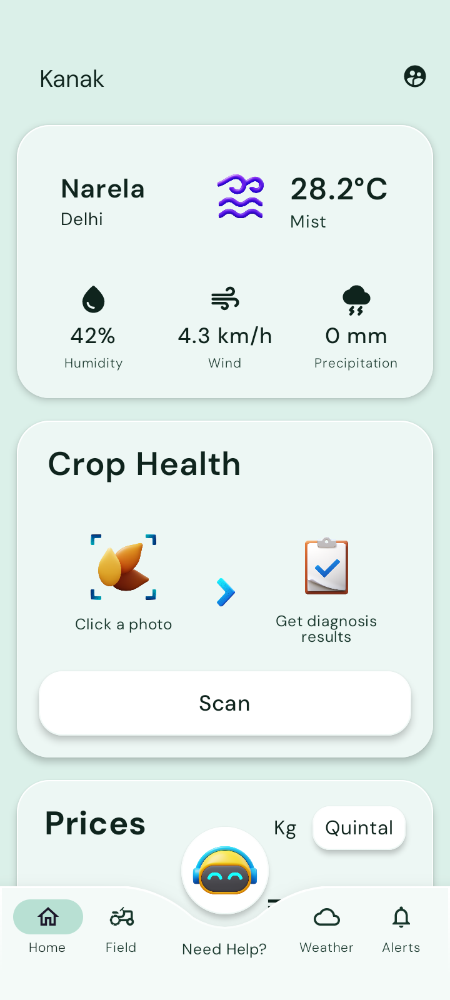
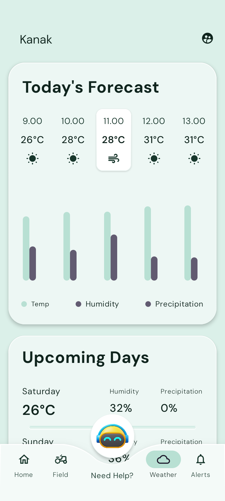
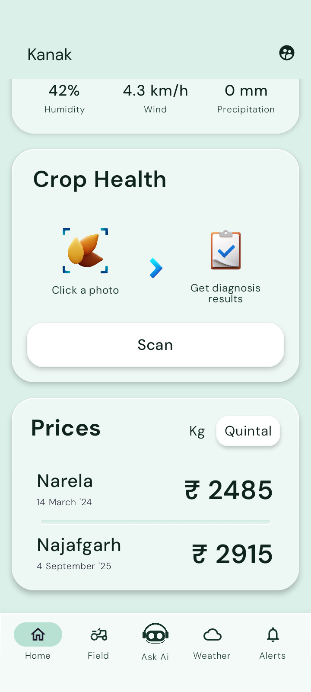

#  About
 An android client for farmers to monitor their field, as well as aims to notify them for any crop disease outbreaks.

#  Intents
- Provide an easy to use interface for the targeted users (farmers).
- Deliver real time updates about local disease outbreaks* and weather info.
- Allow farmer to diagnose crop disease, just by simply capturing the photo of the crop. This will suggest them appropriate actions against the issue. *
- Planned map integration, to help pinpoint specific areas within a field that require attention.
- Real commodity pricing. *

\* - features are under development and may be different in future releases.

#  Screenshots
   
